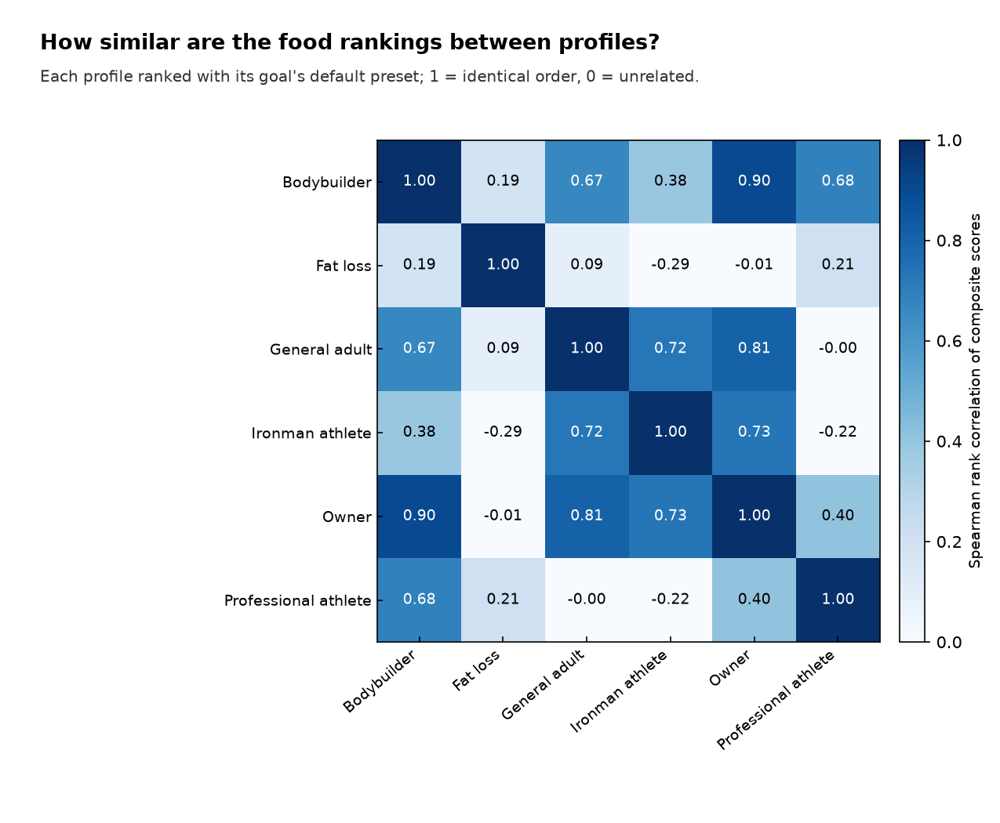

# Scenario comparison of food rankings (v0.2)

Generated by `src/analysis/scenarios.py`. Core foods only (ingredients/snacks/supplements excluded). Ranking = composite score (weighted geometric mean of percentile-normalized metrics, `src/metrics.py`).

## A. Same preset ('Bulking: balanced') for every profile

| profile | spearman vs owner | top-10 overlap vs owner |
|---|---|---|
| Bodybuilder, off-season bulk | 1.00 | 1.00 |
| Fat loss, recreational lifter | 1.00 | 1.00 |
| General adult | 1.00 | 1.00 |
| Ironman athlete (build phase) | 1.00 | 1.00 |
| Owner (test profile 1) | 1.00 | 1.00 |
| Professional athlete (price-insensitive, prescribed targets) | 0.68 | 0.70 |

**Reading:** food-level rankings use only food properties, the weighting, the protein-quality definition and prices. The person's targets (kcal, protein g) do not enter a single-food score, so every profile gets the same list, except a profile with `priorities.cost = 0`, for which all per-€ weights are dropped. Person-specific choices come from the diet optimizer (v1.0), where targets are constraints.

## B. Each profile with its goal's default ranking preset

| profile | goal | ranking preset |
|---|---|---|
| Bodybuilder, off-season bulk | Muscle gain / bodybuilding off-season | Bulking: balanced |
| Fat loss, recreational lifter | Fat loss (cut) | Cutting: filling protein on a budget |
| General adult | General adult (normal life) | Everyday budget |
| Ironman athlete (build phase) | Endurance (triathlon, Ironman) | Endurance carbs on a budget |
| Owner (test profile 1) | Hybrid: muscle gain + endurance | Hybrid: bulk + endurance fuel |
| Professional athlete (price-insensitive, prescribed targets) | Professional athlete (prescribed targets) | Price doesn't matter |

### Top 10 per profile

| rank | Bodybuilder, off-season bulk [Bulking: balanced] | Fat loss, recreational lifter [Cutting: filling protein on a budget] | General adult [Everyday budget] | Ironman athlete [Endurance carbs on a budget] | Owner [Hybrid: bulk + endurance fuel] | Professional athlete [Price doesn't matter] |
|---|---|---|---|---|---|---|
| 1 | Peanuts | Frozen cod/pollock fillet | Split peas | Split peas | Peanuts | Beef (bone-in) |
| 2 | Minced pork | Skyr / high-protein yogurt | Grey peas | Grey peas | Chickpeas (dry) | Minced pork |
| 3 | Minced mixed meat | Textured soy protein | Barley groats / pearl barley | White rice | Split peas | Minced mixed meat |
| 4 | Whole chicken | Curd (biezpiens) | Rolled oats | Rye-wheat bread | Grey peas | Hard cheese |
| 5 | Hard cheese | Chicken breast fillet | Buckwheat groats | Chickpeas (dry) | Peanut butter | Whole chicken |
| 6 | Peanut butter | Turkey breast fillet | Chickpeas (dry) | Pasta | Red lentils | Peanuts |
| 7 | Chickpeas (dry) | Chicken thigh fillet | Red lentils | Buckwheat groats | Dried beans | Ground beef |
| 8 | Chicken legs (bone-in) | Frozen fish fillet | Dried beans | Crispbread | Crispbread | Pork (bone-in) |
| 9 | Processed cheese | Cottage cheese (granular) | Peanuts | White wheat bread | White wheat bread | Processed cheese |
| 10 | Pork (boneless) | Canned stewed meat | White rice | Brown rice | Hard cheese | Peanut butter |

### Pairwise agreement (Spearman ρ of scores / top-10 overlap)

|  | Bodybuilder | Fat loss | General adult | Ironman athlete | Owner | Professional athlete |
|---|---|---|---|---|---|---|
| Bodybuilder | 1.00 | 0.19 | 0.67 | 0.38 | 0.90 | 0.68 |
| Fat loss | 0.19 | 1.00 | 0.09 | -0.29 | -0.01 | 0.21 |
| General adult | 0.67 | 0.09 | 1.00 | 0.72 | 0.81 | -0.00 |
| Ironman athlete | 0.38 | -0.29 | 0.72 | 1.00 | 0.73 | -0.22 |
| Owner | 0.90 | -0.01 | 0.81 | 0.73 | 1.00 | 0.40 |
| Professional athlete | 0.68 | 0.21 | -0.00 | -0.22 | 0.40 | 1.00 |

|  | Bodybuilder | Fat loss | General adult | Ironman athlete | Owner | Professional athlete |
|---|---|---|---|---|---|---|
| Bodybuilder | 1.0 | 0.0 | 0.2 | 0.1 | 0.4 | 0.7 |
| Fat loss | 0.0 | 1.0 | 0.0 | 0.0 | 0.0 | 0.0 |
| General adult | 0.2 | 0.0 | 1.0 | 0.5 | 0.6 | 0.1 |
| Ironman athlete | 0.1 | 0.0 | 0.5 | 1.0 | 0.5 | 0.0 |
| Owner | 0.4 | 0.0 | 0.6 | 0.5 | 1.0 | 0.3 |
| Professional athlete | 0.7 | 0.0 | 0.1 | 0.0 | 0.3 | 1.0 |

### Foods in the top 10 of only one profile

- **Bodybuilder**: Chicken legs (bone-in), Pork (boneless)
- **Fat loss**: Canned stewed meat, Chicken breast fillet, Chicken thigh fillet, Cottage cheese (granular), Curd (biezpiens), Frozen fish fillet, Skyr / high-protein yogurt, Textured soy protein, Turkey breast fillet, Frozen cod/pollock fillet
- **General adult**: Barley groats / pearl barley, Rolled oats
- **Ironman athlete**: Rye-wheat bread, Pasta, Brown rice
- **Owner**: none
- **Professional athlete**: Beef (bone-in), Ground beef, Pork (bone-in)
- **In every profile's top 10:** none

## C. Robustness of the owner's ranking ('Hybrid: bulk + endurance fuel')

| protein quality | price scenario | spearman vs default | top-10 overlap | new in top 10 |
|---|---|---|---|---|
| diaas | central | 1.00 | 1.00 |  |
| diaas | low (band lower edge) | 0.99 | 0.90 | Muesli |
| diaas | high (band upper edge) | 0.99 | 0.80 | Rye-wheat bread, Marinated herring rolls |
| diaas_child | central | 1.00 | 0.90 | Marinated herring rolls |
| diaas_child | low (band lower edge) | 0.99 | 0.80 | Marinated herring rolls, Muesli |
| diaas_child | high (band upper edge) | 0.99 | 0.90 | Marinated herring rolls |
| crude | central | 0.95 | 0.70 | Wholegrain bread, Toast bread, Pasta |
| crude | low (band lower edge) | 0.94 | 0.70 | Wholegrain bread, Toast bread, Pasta |
| crude | high (band upper edge) | 0.95 | 0.70 | Wholegrain bread, Toast bread, Pasta |

## D. Sensitivity to the normalization method (same preset, same foods)

| preset | methods | spearman | top-10 overlap |
|---|---|---|---|
| Bulking: balanced | log vs percentile | 0.97 | 0.80 |
| Bulking: balanced | log vs minmax | 0.89 | 0.60 |
| Bulking: balanced | percentile vs minmax | 0.94 | 0.60 |
| Cutting: filling protein on a budget | log vs percentile | 0.98 | 0.90 |
| Cutting: filling protein on a budget | log vs minmax | 0.99 | 0.90 |
| Cutting: filling protein on a budget | percentile vs minmax | 0.98 | 0.90 |
| Everyday budget | log vs percentile | 0.97 | 0.90 |
| Everyday budget | log vs minmax | 1.00 | 1.00 |
| Everyday budget | percentile vs minmax | 0.98 | 0.90 |
| Endurance carbs on a budget | log vs percentile | 0.95 | 0.80 |
| Endurance carbs on a budget | log vs minmax | 0.78 | 0.50 |
| Endurance carbs on a budget | percentile vs minmax | 0.78 | 0.60 |
| Hybrid: bulk + endurance fuel | log vs percentile | 0.76 | 0.70 |
| Hybrid: bulk + endurance fuel | log vs minmax | 0.72 | 0.40 |
| Hybrid: bulk + endurance fuel | percentile vs minmax | 0.85 | 0.50 |
| Price doesn't matter | log vs percentile | 0.98 | 0.70 |
| Price doesn't matter | log vs minmax | 0.85 | 0.40 |
| Price doesn't matter | percentile vs minmax | 0.91 | 0.60 |

**Reading:** composite scores depend noticeably on how metrics are put on a common scale. Log-ratio scales stretch near-zero values (e.g. fruit with almost no protein), percentile ranks discard magnitudes, linear min-max is dominated by one extreme food. Composite rankings are therefore a convenience view; Pareto fronts and the v1.0 optimizer (targets as constraints, no weighting of incommensurable metrics) are the primary results (PROJECT.md §2, §4).
