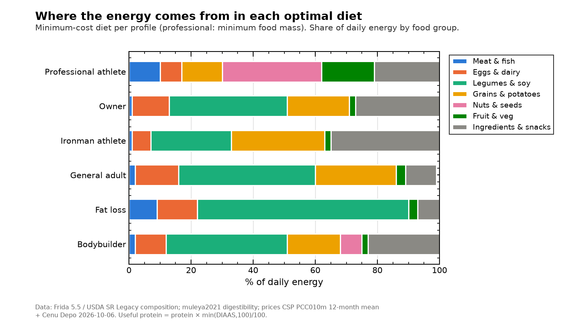
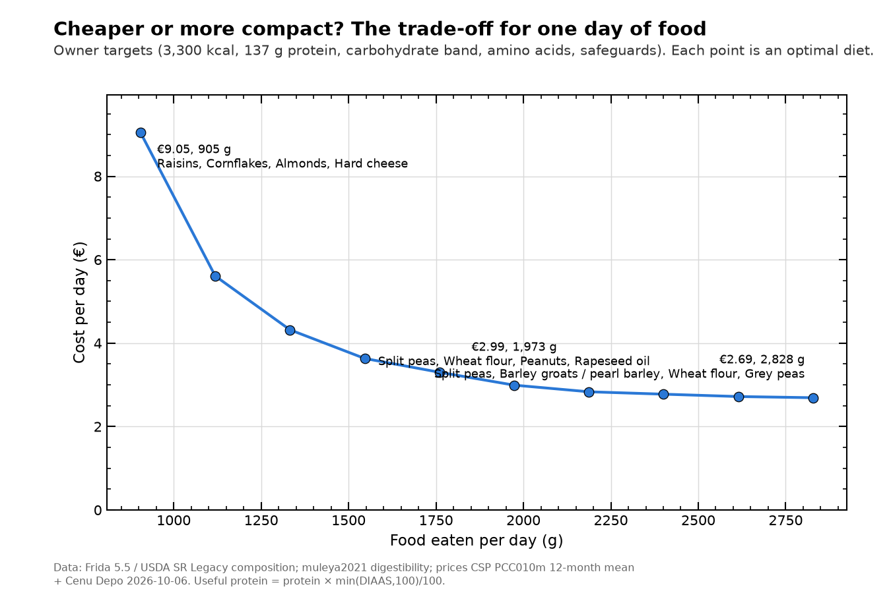

# v1.0 diet optimizer results (generated by `src/analysis/optimize_report.py`)

Linear programme over 90 foods (core + cooking ingredients, priced). Targets from `src/targets.py`; safeguards from `config/optimizer.yaml`; protein quality enforced per amino acid (decision D9). Prices: Latvia 2026-10-06. **These are minimum-cost (or minimum-mass) solutions, i.e. a lower bound and a map of trade-offs, not meal plans**: taste, fibre, micronutrients and variety beyond the safeguards come in v2.0.

## 1. Optimal daily diet per profile

### Bodybuilder, off-season bulk (objective: cost)

| food | g eaten | g bought | € | kcal | protein g | carb g | fat g | energy share |
|---|---|---|---|---|---|---|---|---|
| Split peas | 600.0 | 216.4 | 0.2 | 751.7 | 47.6 | 122.1 | 4.5 | 20 % |
| Grey peas | 514.3 | 185.5 | 0.5 | 654.8 | 33.4 | 120.8 | 3.1 | 17 % |
| Barley groats / pearl barley | 800.0 | 182.4 | 0.3 | 636.7 | 16.9 | 123.8 | 4.4 | 17 % |
| Wheat flour | 150.0 | 150.0 | 0.2 | 515.0 | 14.6 | 104.5 | 2.3 | 13 % |
| Peanuts | 43.0 | 43.0 | 0.2 | 271.4 | 10.6 | 4.1 | 22.9 | 7 % |
| Milk | 436.0 | 436.0 | 0.5 | 218.0 | 14.4 | 20.9 | 8.6 | 6 % |
| Rapeseed oil | 22.2 | 22.2 | 0.1 | 199.8 | 0.0 | 0.0 | 22.2 | 5 % |
| Sugar | 50.0 | 50.0 | 0.1 | 199.8 | 0.0 | 49.9 | 0.0 | 5 % |
| Eggs | 108.4 | 123.4 | 0.7 | 155.3 | 13.6 | 0.8 | 10.3 | 4 % |
| Cabbage | 226.5 | 283.2 | 0.2 | 71.5 | 2.8 | 11.5 | 0.5 | 2 % |
| Red lentils | 57.3 | 21.0 | 0.1 | 67.7 | 4.7 | 9.3 | 0.4 | 2 % |
| Sunflower oil | 4.7 | 4.7 | 0.0 | 42.5 | 0.0 | 0.0 | 4.7 | 1 % |
| Marinated herring rolls | 9.3 | 9.3 | 0.1 | 25.4 | 1.1 | 1.9 | 1.5 | 1 % |
| Whole chicken | 8.4 | 18.2 | 0.1 | 21.5 | 2.2 | 0.0 | 1.4 | 1 % |
| Carrots | 19.4 | 21.8 | 0.0 | 7.0 | 0.1 | 1.2 | 0.1 | 0 % |

**Total:** 3,838 kcal · protein 162 g · carbohydrate 571 g · fat 87 g (20% E) · fibre 60 g · food mass 3,050 g eaten · **cost €3.12/day**
Amino-acid adequacy (supplied ÷ required): lowest LYS 1.00

Binding constraints (objective change per unit tighter): amino acid LYS 0.0947; EPA + DHA (fish omega-3) (min) 0.0822; Zinc (max) 0.0458; Vitamin B12 (min) 0.0174; protein (min) 0.0160

### Fat loss, recreational lifter (objective: cost)

| food | g eaten | g bought | € | kcal | protein g | carb g | fat g | energy share |
|---|---|---|---|---|---|---|---|---|
| Split peas | 492.8 | 177.8 | 0.2 | 617.4 | 39.1 | 100.3 | 3.7 | 29 % |
| Chickpeas (dry) | 423.5 | 183.3 | 0.6 | 617.4 | 34.5 | 76.0 | 11.0 | 29 % |
| Milk | 482.7 | 482.7 | 0.5 | 241.4 | 15.9 | 23.2 | 9.6 | 11 % |
| Red lentils | 182.9 | 67.0 | 0.2 | 216.1 | 15.1 | 29.8 | 1.3 | 10 % |
| Chicken breast fillet | 70.3 | 96.9 | 0.8 | 116.3 | 21.8 | 0.0 | 2.5 | 6 % |
| Sunflower oil | 8.3 | 8.3 | 0.0 | 74.3 | 0.0 | 0.0 | 8.3 | 4 % |
| Cabbage | 197.2 | 246.5 | 0.2 | 62.3 | 2.4 | 10.0 | 0.4 | 3 % |
| Rapeseed oil | 5.9 | 5.9 | 0.0 | 52.9 | 0.0 | 0.0 | 5.9 | 3 % |
| Eggs | 34.8 | 39.7 | 0.2 | 49.9 | 4.4 | 0.2 | 3.3 | 2 % |
| Marinated herring rolls | 12.4 | 12.4 | 0.1 | 33.8 | 1.5 | 2.5 | 2.0 | 2 % |
| Chicken legs (bone-in) | 4.7 | 9.5 | 0.0 | 10.5 | 1.3 | 0.0 | 0.6 | 1 % |
| Carrots | 18.9 | 21.2 | 0.0 | 6.8 | 0.1 | 1.1 | 0.1 | 0 % |

**Total:** 2,099 kcal · protein 136 g · carbohydrate 243 g · fat 49 g (21% E) · fibre 69 g · food mass 1,934 g eaten · **cost €2.98/day**
Amino-acid adequacy (supplied ÷ required): lowest SAA 1.00

Binding constraints (objective change per unit tighter): amino acid SAA 0.4634; ALA (plant omega-3) (min) 0.0917; EPA + DHA (fish omega-3) (min) 0.0664; Vitamin B12 (min) 0.0551; Vitamin E (α-tocopherol) (min) 0.0227

### General adult (objective: cost)

| food | g eaten | g bought | € | kcal | protein g | carb g | fat g | energy share |
|---|---|---|---|---|---|---|---|---|
| Barley groats / pearl barley | 646.6 | 147.4 | 0.2 | 514.6 | 13.6 | 100.1 | 3.5 | 26 % |
| Green/brown lentils | 389.4 | 142.6 | 0.8 | 441.8 | 29.2 | 59.0 | 2.7 | 22 % |
| Split peas | 338.2 | 122.0 | 0.1 | 423.8 | 26.9 | 68.8 | 2.6 | 22 % |
| Milk | 566.3 | 566.3 | 0.6 | 283.1 | 18.7 | 27.2 | 11.2 | 14 % |
| Sunflower oil | 15.1 | 15.1 | 0.1 | 136.1 | 0.0 | 0.0 | 15.1 | 7 % |
| Cabbage | 197.7 | 247.1 | 0.2 | 62.4 | 2.4 | 10.1 | 0.4 | 3 % |
| Rapeseed oil | 6.8 | 6.8 | 0.0 | 61.2 | 0.0 | 0.0 | 6.8 | 3 % |
| Marinated herring rolls | 14.1 | 14.1 | 0.1 | 38.2 | 1.7 | 2.8 | 2.3 | 2 % |
| Carrots | 19.4 | 21.8 | 0.0 | 7.0 | 0.1 | 1.2 | 0.1 | 0 % |

**Total:** 1,968 kcal · protein 93 g · carbohydrate 269 g · fat 45 g (20% E) · fibre 61 g · food mass 2,194 g eaten · **cost €2.22/day**
Amino-acid adequacy (supplied ÷ required): lowest SAA 1.27

Binding constraints (objective change per unit tighter): EPA + DHA (fish omega-3) (min) 0.2607; Vitamin B6 (min) 0.2373; Selenium (min) 0.0139; fat (min) 0.0029; Vitamin C (min) 0.0008

### Ironman athlete (build phase) (objective: cost)

| food | g eaten | g bought | € | kcal | protein g | carb g | fat g | energy share |
|---|---|---|---|---|---|---|---|---|
| Split peas | 600.0 | 216.4 | 0.2 | 751.7 | 47.6 | 122.1 | 4.5 | 18 % |
| Barley groats / pearl barley | 800.0 | 182.4 | 0.3 | 636.7 | 16.9 | 123.8 | 4.4 | 15 % |
| Wheat flour | 150.0 | 150.0 | 0.2 | 515.0 | 14.6 | 104.5 | 2.3 | 12 % |
| Semolina | 800.0 | 125.5 | 0.2 | 443.1 | 11.8 | 93.9 | 1.5 | 11 % |
| Sunflower oil | 40.0 | 40.0 | 0.1 | 360.0 | 0.0 | 0.0 | 40.0 | 9 % |
| Rapeseed oil | 40.0 | 40.0 | 0.1 | 360.0 | 0.0 | 0.0 | 40.0 | 9 % |
| Green/brown lentils | 283.7 | 103.9 | 0.6 | 321.8 | 21.3 | 42.9 | 1.9 | 8 % |
| Milk | 479.2 | 479.2 | 0.5 | 239.6 | 15.8 | 23.0 | 9.5 | 6 % |
| Sugar | 50.0 | 50.0 | 0.1 | 199.8 | 0.0 | 49.9 | 0.0 | 5 % |
| White rice | 121.9 | 46.0 | 0.1 | 162.9 | 3.9 | 35.5 | 0.6 | 4 % |
| Cabbage | 229.0 | 286.2 | 0.2 | 72.3 | 2.8 | 11.7 | 0.5 | 2 % |
| Marinated herring rolls | 19.9 | 19.9 | 0.2 | 53.9 | 2.4 | 4.0 | 3.2 | 1 % |
| Carrots | 28.2 | 31.7 | 0.0 | 10.2 | 0.2 | 1.7 | 0.1 | 0 % |

**Total:** 4,127 kcal · protein 137 g · carbohydrate 613 g · fat 108 g (24% E) · fibre 76 g · food mass 3,642 g eaten · **cost €2.91/day**
Amino-acid adequacy (supplied ÷ required): lowest LYS 1.13

Binding constraints (objective change per unit tighter): Vitamin B12 (min) 0.0566; Selenium (min) 0.0130; Vitamin C (min) 0.0016; energy (min) 0.0005; Calcium (min) 0.0002

### Owner (test profile 1) (objective: cost)

| food | g eaten | g bought | € | kcal | protein g | carb g | fat g | energy share |
|---|---|---|---|---|---|---|---|---|
| Split peas | 600.0 | 216.4 | 0.2 | 751.7 | 47.6 | 122.1 | 4.5 | 23 % |
| Barley groats / pearl barley | 800.0 | 182.4 | 0.3 | 636.7 | 16.9 | 123.8 | 4.4 | 20 % |
| Wheat flour | 150.0 | 150.0 | 0.2 | 515.0 | 14.6 | 104.5 | 2.3 | 16 % |
| Grey peas | 281.7 | 101.6 | 0.2 | 358.6 | 18.3 | 66.2 | 1.7 | 11 % |
| Rapeseed oil | 31.1 | 31.1 | 0.1 | 280.0 | 0.0 | 0.0 | 31.1 | 9 % |
| Milk | 499.9 | 499.9 | 0.6 | 249.9 | 16.5 | 24.0 | 9.9 | 8 % |
| Green/brown lentils | 111.2 | 40.7 | 0.2 | 126.2 | 8.3 | 16.8 | 0.8 | 4 % |
| Eggs | 82.3 | 93.7 | 0.5 | 117.9 | 10.3 | 0.6 | 7.8 | 4 % |
| Sunflower oil | 8.4 | 8.4 | 0.0 | 75.5 | 0.0 | 0.0 | 8.4 | 2 % |
| Cabbage | 228.7 | 285.9 | 0.2 | 72.2 | 2.8 | 11.6 | 0.5 | 2 % |
| Marinated herring rolls | 11.4 | 11.4 | 0.1 | 30.9 | 1.4 | 2.3 | 1.8 | 1 % |
| Sugar | 3.0 | 3.0 | 0.0 | 12.1 | 0.0 | 3.0 | 0.0 | 0 % |
| Carrots | 19.9 | 22.3 | 0.0 | 7.2 | 0.1 | 1.2 | 0.1 | 0 % |

**Total:** 3,234 kcal · protein 137 g · carbohydrate 476 g · fat 73 g (20% E) · fibre 60 g · food mass 2,828 g eaten · **cost €2.69/day**
Amino-acid adequacy (supplied ÷ required): lowest SAA 1.01

Binding constraints (objective change per unit tighter): EPA + DHA (fish omega-3) (min) 0.1967; Selenium (min) 0.0136; protein (min) 0.0086; Dietary fibre (max) 0.0052; Vitamin C (min) 0.0017

### Professional athlete (price-insensitive, prescribed targets) (objective: mass)

| food | g eaten | g bought | € | kcal | protein g | carb g | fat g | energy share |
|---|---|---|---|---|---|---|---|---|
| Raisins | 210.6 | 210.6 | 1.9 | 701.7 | 6.8 | 157.4 | 3.4 | 17 % |
| Almonds | 98.0 | 98.0 | 1.6 | 594.3 | 20.8 | 7.7 | 51.1 | 14 % |
| Peanuts | 89.1 | 89.1 | 0.5 | 562.7 | 21.9 | 8.5 | 47.5 | 14 % |
| Cornflakes | 135.8 | 135.8 | 1.4 | 521.3 | 8.0 | 119.5 | 1.2 | 13 % |
| Wheat flour | 150.0 | 150.0 | 0.2 | 515.0 | 14.6 | 104.5 | 2.3 | 13 % |
| Chicken breast fillet | 232.9 | 321.2 | 2.6 | 385.4 | 72.3 | 0.0 | 8.4 | 9 % |
| Hard cheese | 79.3 | 79.3 | 0.9 | 271.8 | 19.4 | 0.0 | 21.2 | 7 % |
| Sugar | 50.0 | 50.0 | 0.1 | 199.8 | 0.0 | 49.9 | 0.0 | 5 % |
| Walnuts | 24.3 | 24.3 | 0.4 | 168.2 | 3.4 | 2.5 | 15.7 | 4 % |
| Honey | 50.0 | 50.0 | 0.6 | 163.6 | 0.1 | 40.8 | 0.0 | 4 % |
| Salmon fillet | 10.7 | 11.6 | 0.2 | 24.1 | 2.4 | 0.0 | 1.6 | 1 % |
| Cabbage | 25.5 | 31.8 | 0.0 | 8.0 | 0.3 | 1.3 | 0.1 | 0 % |

**Total:** 4,116 kcal · protein 170 g · carbohydrate 492 g · fat 152 g (33% E) · fibre 40 g · food mass 1,156 g eaten · **cost €10.42/day**
Amino-acid adequacy (supplied ÷ required): lowest VAL 1.17

Binding constraints (objective change per unit tighter): Iron (max) 7.2560; EPA + DHA (fish omega-3) (min) 7.0899; protein (min) 3.0689; Vitamin C (min) 1.9398; ALA (plant omega-3) (min) 1.7752

### Summary

| profile | kcal target | protein target g | cost €/day | food mass g | foods | animal-food energy % |
|---|---|---|---|---|---|---|
| Bodybuilder, off-season bulk | 3916.6 | 162.0 | 3.1 | 3049.7 | 15 | 12.0 |
| Fat loss, recreational lifter | 2058.1 | 136.1 | 3.0 | 1934.5 | 12 | 22.0 |
| General adult | 2008.5 | 65.0 | 2.2 | 2193.7 | 9 | 16.0 |
| Ironman athlete (build phase) | 4211.1 | 115.2 | 2.9 | 3641.9 | 13 | 7.0 |
| Owner (test profile 1) | 3300.0 | 136.8 | 2.7 | 2827.6 | 13 | 13.0 |
| Professional athlete (price-insensitive, prescribed targets) | 4200.0 | 170.0 | 10.4 | 1156.0 | 12 | 17.0 |

## 2. H11: what the safeguards do (owner profile, minimum cost)

| safeguards | cost €/day | mass g | foods | fat % E | largest contributors |
|---|---|---|---|---|---|
| none | 1.0 | 2015.5 | 3 | 5.1 | Split peas 55%, Wheat flour 43%, Rolled oats 3% |
| macros | 1.4 | 2809.1 | 4 | 19.6 | Split peas 50%, Rolled oats 28%, Rapeseed oil 12% |
| full | 2.7 | 2827.6 | 13 | 20.4 | Split peas 23%, Barley groats / pearl barley 20%, Wheat flour 16% |

`none` = energy + protein + amino acids only; `macros` adds carbohydrate band, fat 20–35 % E and the free-sugar cap; `full` adds per-food caps and ≤ 30 % of energy per food.

## 3. H9: how protein quality is enforced changes the diet (owner, minimum cost)

| protein constraint | cost €/day | protein g | lowest AA adequacy | foods |
|---|---|---|---|---|
| per amino acid, diet level (D9) | 2.69 | 136.80 | SAA 1.01 | Split peas, Barley groats / pearl barley, Wheat flour, Grey peas, Rapeseed oil |
| Σ protein × DIAAS, food level | 3.54 | 167.20 | SAA 1.20 | Split peas, Grey peas, Chickpeas (dry), Milk, Potatoes |
| crude protein only | 2.69 | 136.80 | SAA 1.01 | Split peas, Barley groats / pearl barley, Wheat flour, Grey peas, Rapeseed oil |

Adequacy < 1.00 means the diet does not supply that amino acid at the reference-protein level for the protein target. Food-level Σ P×DIAAS ignores complementarity between foods and over-constrains the diet; crude protein under-constrains it.

## 4. H5: cost vs food mass (owner): ε-constraint Pareto front

| max_mass_g | cost_eur | mass_g | n_foods | main_foods |
|---|---|---|---|---|
| 905.05 | 9.05 | 905.14 | 11 | Raisins, Cornflakes, Almonds, Hard cheese |
| 1118.67 | 5.61 | 1118.78 | 13 | Peanuts, Muesli, Wheat flour, Processed cheese |
| 1332.28 | 4.32 | 1332.41 | 14 | Peanuts, Wheat flour, Split peas, Processed cheese |
| 1545.90 | 3.63 | 1546.05 | 13 | Split peas, Peanuts, Wheat flour, Processed cheese |
| 1759.51 | 3.30 | 1759.69 | 16 | Split peas, Wheat flour, Peanuts, Rapeseed oil |
| 1973.13 | 2.99 | 1973.32 | 16 | Split peas, Wheat flour, Peanuts, Rapeseed oil |
| 2186.74 | 2.83 | 2186.96 | 14 | Split peas, Wheat flour, Peanuts, Rapeseed oil |
| 2400.36 | 2.78 | 2400.60 | 15 | Split peas, Wheat flour, Peanuts, Barley groats / pearl barley |
| 2613.97 | 2.72 | 2614.23 | 16 | Split peas, Wheat flour, Barley groats / pearl barley, Milk |
| 2827.59 | 2.69 | 2827.59 | 13 | Split peas, Barley groats / pearl barley, Wheat flour, Grey peas |

## 5. Near-optimal alternatives (ban one main food, re-optimize)

| banned | status | cost_eur | cost_change_pct | new_foods |
|---|---|---|---|---|
| Split peas | optimal | 3.14 | 16.72 | Peanuts, Red lentils, Semolina |
| Barley groats / pearl barley | optimal | 2.78 | 3.31 | Buckwheat groats, Rolled oats, Semolina |
| Wheat flour | optimal | 2.86 | 6.44 | Rolled oats, Semolina |
| Grey peas | optimal | 2.73 | 1.54 | Peanuts, Red lentils, Semolina |
| Rapeseed oil | optimal | 2.84 | 5.39 | Walnuts |

## 6. Sensitivity to judgment-call safeguards (owner, minimum cost)

| max energy share per food | cost €/day | foods | top foods |
|---|---|---|---|
| 0.2 | 2.74 | 12 | Split peas, Barley groats / pearl barley, Wheat flour, Grey peas |
| 0.3 | 2.69 | 13 | Split peas, Barley groats / pearl barley, Wheat flour, Grey peas |
| 0.5 | 2.69 | 13 | Split peas, Barley groats / pearl barley, Wheat flour, Grey peas |
| 0.3 + legumes ≤ 300 g | 2.93 | 14 | Barley groats / pearl barley, Wheat flour, Grey peas, Split peas |

