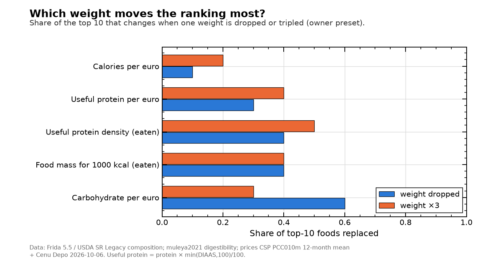
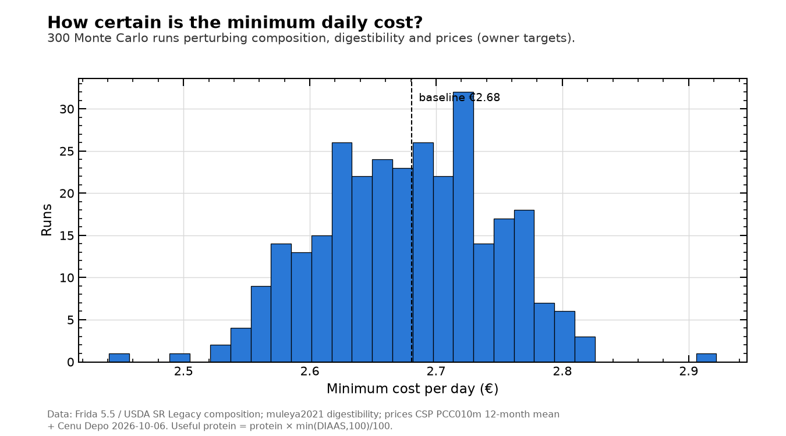

# v1.x robustness (generated by `src/analysis/robustness.py`)

## D.1 Price scenarios (each profile, its own objective)

| profile | prices | cost €/day | mass g | same foods (Jaccard) |
|---|---|---|---|---|
| Bodybuilder | central | 3.10 | 3145.17 | 1.00 |
| Bodybuilder | low band | 2.76 | 3231.68 | 0.58 |
| Bodybuilder | high band | 3.45 | 3119.56 | 0.81 |
| Bodybuilder | Cenu Depo prices +10 % | 3.17 | 3145.17 | 1.00 |
| Fat loss | central | 2.92 | 2074.00 | 1.00 |
| Fat loss | low band | 2.58 | 2069.67 | 0.73 |
| Fat loss | high band | 3.19 | 1934.34 | 0.73 |
| Fat loss | Cenu Depo prices +10 % | 3.02 | 2072.14 | 0.82 |
| General adult | central | 2.22 | 2159.23 | 1.00 |
| General adult | low band | 1.89 | 1973.48 | 0.82 |
| General adult | high band | 2.41 | 2079.17 | 0.91 |
| General adult | Cenu Depo prices +10 % | 2.29 | 2097.31 | 0.83 |
| Ironman athlete | central | 2.91 | 3641.90 | 1.00 |
| Ironman athlete | low band | 2.59 | 3665.53 | 0.86 |
| Ironman athlete | high band | 3.21 | 3641.90 | 1.00 |
| Ironman athlete | Cenu Depo prices +10 % | 2.99 | 3693.32 | 0.86 |
| Owner | central | 2.68 | 2828.40 | 1.00 |
| Owner | low band | 2.36 | 2928.26 | 0.73 |
| Owner | high band | 2.96 | 3114.00 | 0.62 |
| Owner | Cenu Depo prices +10 % | 2.74 | 3114.00 | 0.62 |
| Professional athlete | central | 10.12 | 1151.10 | 1.00 |
| Professional athlete | low band | 9.15 | 1151.10 | 1.00 |
| Professional athlete | high band | 10.87 | 1151.10 | 1.00 |
| Professional athlete | Cenu Depo prices +10 % | 10.32 | 1151.10 | 1.00 |

Band edges = CSP 12-month min/max or Cenu Depo P25/P75. '+10 %' corrects Cenu Depo prices toward the CSP level (cross-check showed Cenu Depo ≈ 10 % lower). Per-retailer scenarios need per-retailer CSP data (not public).

## D.2 Amino-acid reference pattern (owner)

| reference pattern | cost €/day | protein g | same foods (Jaccard) | foods |
|---|---|---|---|---|
| adult (3+ y), default | 2.68 | 136.80 | 1.00 | Split peas, Barley groats / pearl barley, Wheat flour, Grey peas, Rapeseed oil, Milk |
| young child 0.5–3 y (stricter) | 2.93 | 152.36 | 0.67 | Split peas, Wheat flour, Grey peas, Rolled oats, Milk, Red lentils |

## D.3 Sensitivity of the composite ranking to each weight ('Hybrid: bulk + endurance fuel')

| metric | change | spearman | top10_overlap |
|---|---|---|---|
| Calories per euro | dropped | 0.92 | 0.90 |
| Calories per euro | ×3 | 0.94 | 0.80 |
| Useful protein per euro | dropped | 0.91 | 0.70 |
| Useful protein per euro | ×3 | 0.92 | 0.60 |
| Carbohydrate per euro | dropped | 0.90 | 0.40 |
| Carbohydrate per euro | ×3 | 0.86 | 0.70 |
| Useful protein density (eaten) | dropped | 0.92 | 0.60 |
| Useful protein density (eaten) | ×3 | 0.85 | 0.50 |
| Food mass for 1000 kcal (eaten) | dropped | 0.90 | 0.60 |
| Food mass for 1000 kcal (eaten) | ×3 | 0.91 | 0.60 |

## D.4 Safeguard and target sensitivity (owner, minimum cost)

| variant | status | cost €/day | Δ cost % | mass g | same foods (Jaccard) | main foods |
|---|---|---|---|---|---|---|
| baseline | optimal | 2.68 | 0.00 | 2828.40 | 1.00 | Split peas, Barley groats / pearl barley, Wheat flour, Grey peas |
| protein 1.6 g/kg | optimal | 2.56 | -4.62 | 2719.19 | 0.80 | Split peas, Barley groats / pearl barley, Wheat flour, Rapeseed oil |
| protein 2.2 g/kg | optimal | 3.15 | 17.46 | 2876.00 | 0.53 | Split peas, Grey peas, Wheat flour, Barley groats / pearl barley |
| carbohydrate band 6–10 g/kg (high training) | optimal | 2.68 | 0.00 | 2828.40 | 1.00 | Split peas, Barley groats / pearl barley, Wheat flour, Grey peas |
| carbohydrate band 3–5 g/kg (light) | optimal | 2.78 | 3.67 | 2435.41 | 0.67 | Split peas, Wheat flour, Barley groats / pearl barley, Peanuts |
| fat min 15 % E | optimal | 2.65 | -0.96 | 2851.26 | 1.00 | Split peas, Barley groats / pearl barley, Wheat flour, Grey peas |
| fat min 25 % E | optimal | 2.72 | 1.44 | 2719.94 | 0.73 | Split peas, Barley groats / pearl barley, Wheat flour, Rapeseed oil |
| free sugars ≤ 5 % E | optimal | 2.68 | 0.00 | 2828.40 | 1.00 | Split peas, Barley groats / pearl barley, Wheat flour, Grey peas |
| max 20 % energy per food | optimal | 2.73 | 1.98 | 2830.54 | 0.86 | Split peas, Barley groats / pearl barley, Wheat flour, Grey peas |
| max 50 % energy per food | optimal | 2.68 | 0.00 | 2828.40 | 1.00 | Split peas, Barley groats / pearl barley, Wheat flour, Grey peas |
| energy −10 % | optimal | 2.63 | -1.82 | 2483.38 | 0.73 | Split peas, Wheat flour, Barley groats / pearl barley, Peanuts |
| energy +10 % | optimal | 2.78 | 3.59 | 2998.49 | 0.93 | Split peas, Barley groats / pearl barley, Wheat flour, Rapeseed oil |
| food mass ≤ 2,000 g | optimal | 2.96 | 10.24 | 2000.00 | 0.65 | Split peas, Wheat flour, Peanuts, Rapeseed oil |
| food mass ≤ 1,500 g | optimal | 3.73 | 39.12 | 1500.00 | 0.44 | Split peas, Peanuts, Wheat flour, Processed cheese |
| MILP: ≥ 10 foods, ≥ 50 g each | optimal | 2.88 | 7.58 | 2388.75 | 0.60 | Peanuts, Split peas, Wheat flour, Milk |
| all per-food caps ×0.5 | optimal | 3.02 | 12.80 | 2941.67 | 0.72 | Grey peas, Split peas, Red lentils, Barley groats / pearl barley |
| all per-food caps ×2.0 | optimal | 2.52 | -6.00 | 2848.84 | 0.85 | Split peas, Barley groats / pearl barley, Wheat flour, Milk |

## D.5 Monte Carlo (300 runs; composition CV A/B/C = 5/10/20 %, digestibility CV 3/6/12 %, prices uniform within their bands; assumptions [U])

Optimal cost: median €2.68/day (5–95 %: €2.56–2.78); baseline €2.68. Infeasible draws: 0.

**How often each food is in the optimal diet**

| food | selected in % of runs | median g eaten when selected | in baseline |
|---|---|---|---|
| Split peas | 100.0 | 600.0 | True |
| Barley groats / pearl barley | 100.0 | 791.8 | True |
| Wheat flour | 100.0 | 150.0 | True |
| Milk | 100.0 | 580.7 | True |
| Sunflower oil | 100.0 | 28.0 | True |
| Cabbage | 100.0 | 229.4 | True |
| Carrots | 100.0 | 17.1 | True |
| Eggs | 91.3 | 79.7 | True |
| Grey peas | 84.7 | 195.4 | True |
| Green/brown lentils | 58.7 | 115.5 | True |
| Rapeseed oil | 57.0 | 26.8 | True |
| Sugar | 54.0 | 22.8 | True |
| Red lentils | 51.3 | 151.8 | False |
| Semolina | 40.3 | 384.6 | False |
| Marinated herring rolls | 34.7 | 4.7 | True |

**How often each food is in the composite top 10** (owner preset)

| food | % of runs |
|---|---|
| Peanuts | 100 |
| Chickpeas (dry) | 100 |
| Grey peas | 100 |
| Split peas | 100 |
| Red lentils | 100 |
| Dried beans | 100 |
| Crispbread | 98 |
| White wheat bread | 79 |
| Peanut butter | 61 |
| Muesli | 41 |
| Rye-wheat bread | 40 |
| Hard cheese | 37 |
| White rice | 20 |
| Wholegrain bread | 11 |
| Marinated herring rolls | 9 |

## D.6 Composition database: Frida 5.5 vs USDA SR Legacy (foods with both, raw state)

28 foods. kcal: median |difference| 9.0 % (max 41 %); protein: median |difference| 8.1 % (max 30 %).

| food_id | kcal Frida | protein Frida | kcal USDA | protein USDA | kcal diff % | protein diff % |
|---|---|---|---|---|---|---|
| beans_dried | 275.8 | 18.0 | 333.0 | 23.4 | 20.7 | 29.7 |
| peas_grey | 352.9 | 18.0 | 364.0 | 23.1 | 3.1 | 28.4 |
| semolina | 353.0 | 9.4 | 360.0 | 11.6 | 2.0 | 23.7 |
| potatoes | 85.7 | 2.2 | 69.0 | 1.7 | -19.5 | -23.6 |
| sweet_potato | 71.6 | 1.3 | 86.0 | 1.6 | 20.2 | 20.5 |
| lentils_green | 309.8 | 20.5 | 352.0 | 24.6 | 13.6 | 20.3 |
| rice_brown | 357.9 | 9.0 | 367.0 | 7.5 | 2.6 | -16.2 |
| rice_white | 354.2 | 8.4 | 365.0 | 7.1 | 3.0 | -15.1 |
| bulgur | 341.5 | 10.8 | 342.0 | 12.3 | 0.1 | 13.9 |
| chicken_liver | 115.8 | 19.1 | 119.0 | 16.9 | 2.8 | -11.4 |

Owner minimum-cost diet: Frida-based €2.68/day vs USDA-based €2.59/day; same foods (Jaccard) 1.00.

H7 (Latvian vs generic prices) cannot be tested yet: it needs a second, comparable price source (e.g. another country's official average prices).
